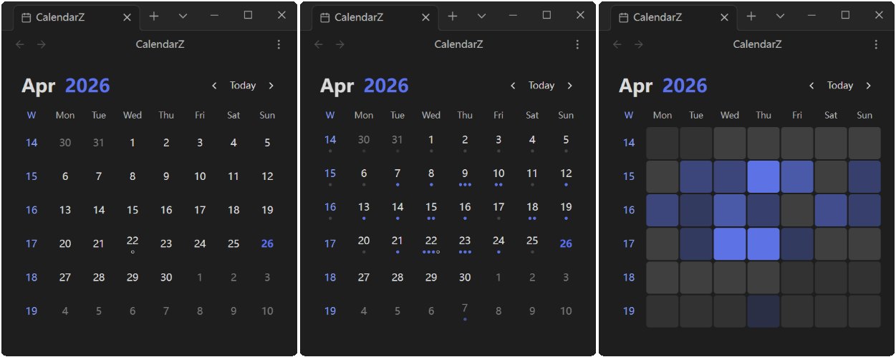

# CalendarZ

A visual calendar plugin for Obsidian with heatmap & dots tracking for your daily notes.

I love [obsidian-calendar-plugin](https://github.com/liamcain/obsidian-calendar-plugin), but the last update was 4 years ago, and I want some new features.

So, I made a new calendar plugin, CalendarZ.

## Features

### Visual Note Tracking

- **Heatmap Mode**: Display varying color intensities based on note count or word count, giving you an instant overview of your writing activity
- **Dots Mode**: Each dot represents a configurable number of notes or words, providing a clean visual representation of daily output
- **None Mode**: Clean calendar view focused purely on date navigation

### Flexible Date Recognition

- **YAML Frontmatter**: Extract dates from note frontmatter with customizable field names
- **Filename Parsing**: Parse dates from filenames, supporting various date formats
- **Both YAML and Filename**: Automatically detect and use dates from both sources

### Periodic Note Integration

- **Daily Notes**: Click any date to open or create the corresponding daily note
- **Weekly Notes**: Enable weekly notes and click week numbers to create or open weekly notes
- **Monthly Notes**: Enable monthly notes and click month headers to create or open monthly notes
- **Yearly Notes**: Enable yearly notes and click year headers to create or open yearly notes
- **Customizable Naming**: Configure naming formats for all note types (e.g., `YYYY-[W]WW`, `YYYY-MM`, `YYYY`)
- **Template Support**: Use templates and custom folder paths for all periodic note types
- **Confirmation Prompt**: Optional confirmation before creating new notes to prevent accidental creation

### Todo Status Indicators

- Visual indicators show todo completion status on calendar dates
- Quickly identify dates with pending or completed todos at a glance
- Option to hide completed todos for a cleaner view

### Statistics Options

- **Note Count**: Track the number of notes per day
- **Word Count**: Track total word count per day

### Customization

- **Week Start**: Sunday or Monday
- **Month Display Format**: Numeric, short, or long format
- **Title Format**: Year-Month or Month-Year order
- **Ignored Folders**: Exclude specific folders from note statistics
- **Week Numbers**: Optionally display week numbers on the left side of the calendar

## Usage

- **Settings → Community Plugins → CalendarZ** → **Open Calendar View**
- Use the Command Palette (`Ctrl/Cmd + P`) and search for "CalendarZ: Open Calendar"

## Supported Languages

- **English** (en-US)
- **简体中文** (zh-CN)

## Contributing

Issues and Pull Requests are welcome!

## Special Thanks

- [liamcain](https://github.com/liamcain) for the [obsidian-calendar-plugin](https://github.com/liamcain/obsidian-calendar-plugin).

***

If you find this plugin helpful, please consider giving it a ⭐️

You can also support me by buying me a coffee:

